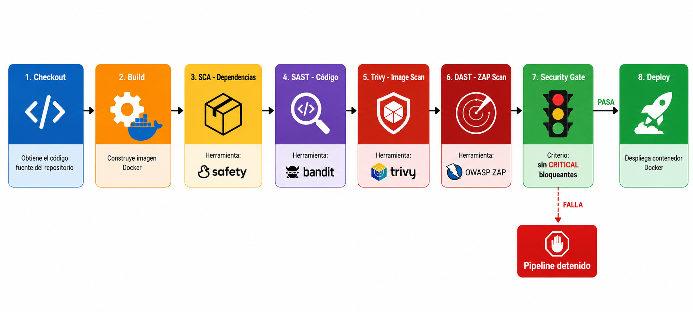

# Jenkins DevSecOps Pipeline


Pipeline DevSecOps implementado en Jenkins con escaneos de seguridad integrados en cada etapa del ciclo de vida del software. Incluye análisis estático, escaneo de dependencias, análisis de imagen Docker y pruebas dinámicas con OWASP ZAP.

---

## Diagrama del Pipeline



---

## Etapas del Pipeline

| # | Stage | Herramienta | Tipo |
|---|-------|-------------|------|
| 1 | Checkout | Jenkins SCM | Control de versiones |
| 2 | Build | Docker | Construcción de imagen |
| 3 | SCA - Dependencias | Safety | Análisis de composición |
| 4 | SAST - Código | Bandit | Análisis estático |
| 5 | Trivy - Image Scan | Trivy | Escaneo de imagen |
| 6 | DAST - ZAP Scan | OWASP ZAP | Análisis dinámico |
| 7 | Security Gate | Criterios definidos | Control de calidad |
| 8 | Deploy | Docker | Despliegue |

---

## Security Gate — Criterios definidos

El pipeline solo avanza al Deploy si se cumplen todas las condiciones:

- SAST completado sin errores críticos bloqueantes
- SCA con dependencias revisadas
- Trivy con reporte de imagen generado
- ZAP con análisis dinámico ejecutado

Si alguna etapa anterior falla, el Deploy se cancela automáticamente.

---

## Escaneos de Seguridad

**SCA (Software Composition Analysis)** — Safety revisa las dependencias del proyecto contra bases de datos de vulnerabilidades conocidas.

**SAST (Static Application Security Testing)** — Bandit analiza el código fuente Python sin ejecutarlo, detectando patrones inseguros.

**Trivy** — Escanea la imagen Docker construida buscando vulnerabilidades en el sistema operativo y paquetes. En este proyecto se detectaron 2 CRITICAL y 7 HIGH como evidencia real del análisis.

**DAST (Dynamic Application Security Testing)** — OWASP ZAP ataca la aplicación en ejecución simulando un atacante externo.

---

## Estructura del Proyecto

```
jenkins-devsecops-pipeline/
├── Jenkinsfile              # Definición del pipeline
├── Dockerfile               # Imagen base de la aplicación
├── docker-compose.yml       # Infraestructura reproducible
├── diagrama-pipeline.png    # Diagrama visual del pipeline
└── README.md
```

---

## Infraestructura con Docker Compose

El entorno completo es reproducible con un solo comando:

```bash
docker compose up -d
```

Servicios incluidos: `jenkins-master`, `nodo-dev`, `nodo-staging` en red interna `jenkins-net` con volumen persistente `jenkins-data`.

---

## Cómo ejecutar el pipeline

```bash
# 1. Levantar la infraestructura
docker compose up -d

# 2. Acceder a Jenkins
# http://localhost:8080

# 3. Abrir el proyecto jenkins-devsecops-pipeline
# 4. Clic en Build Now
```

---

## Relación con otros repositorios

Los tests E2E automatizados que validan la aplicación desplegada se encuentran en [cypress-e2e-suite](https://github.com/Yoselin-C/cypress-e2e-suite).

---

## Contacto

**Yulisa Calo**  
Systems Engineering Student — Universidad Mariano Gálvez de Guatemala  
[](https://linkedin.com/in/tu-perfil)
[](https://github.com/Yoselin-C)
